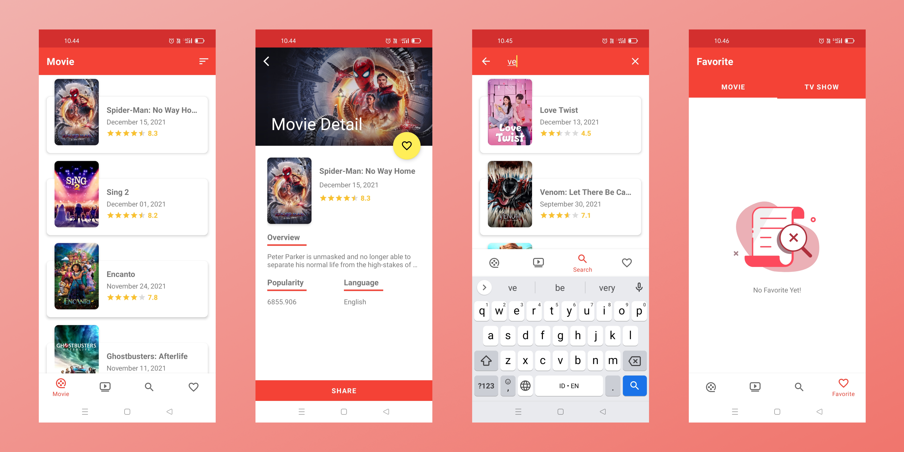

# Movie-App

Some facts about this project:

- MVVM Architecture Pattern
- Modularization (Core Module)
- Dynamic Feature (Favorite Module)
- Clean Architecture (Data, Domain, Presentation)
- Using ViewBinding
- Using Coroutines Flow
- Using Room Persistence
- Using Rawquery for Sorting Data from Local Database
- Using Shimmer Layout and Lottie Animation
- Using Retrofit and OkHttp Library for Networking
- Using The Movie Database (TMDB) API
- Dependency Injection with Koin3
- Support Offline Online
- Obfuscation with Proguard
- Encryption with SQLCipher
- Certificate Pinning with OkHttp
- Continuous Integration with Circle-CI

## Preview App

## License

Distributed under the MIT License. See `LICENSE` for more information.

## Contact

Mochammad Arya Salsabila - Aryasalsabila789@gmail.com
